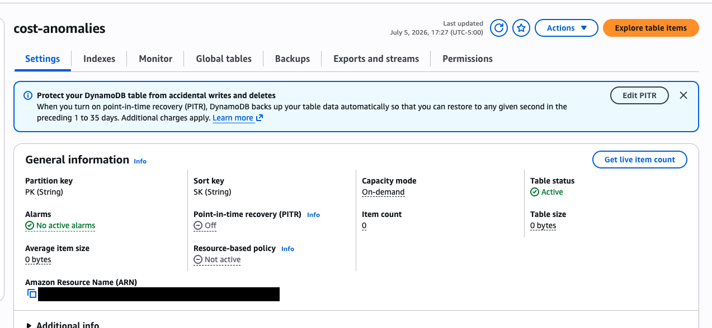
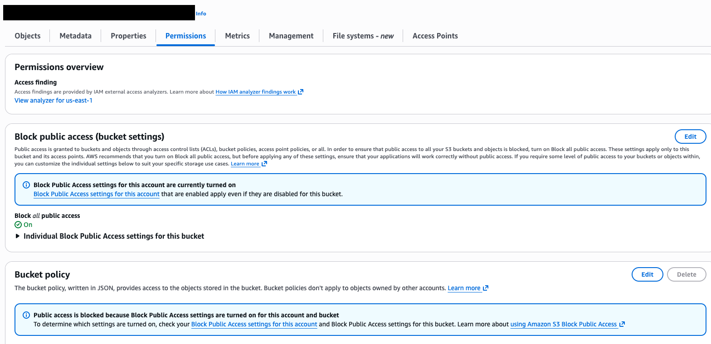
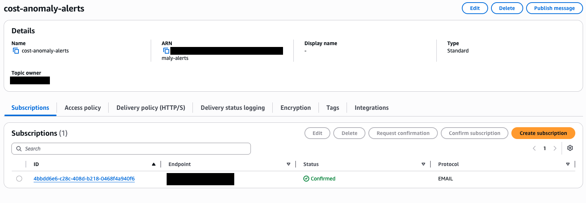
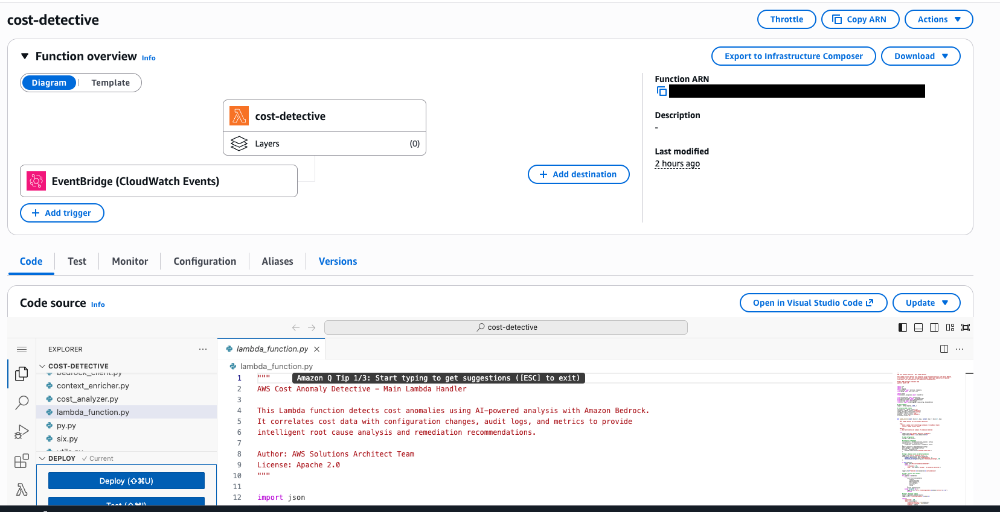
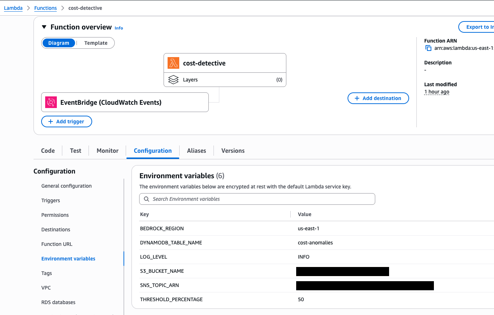
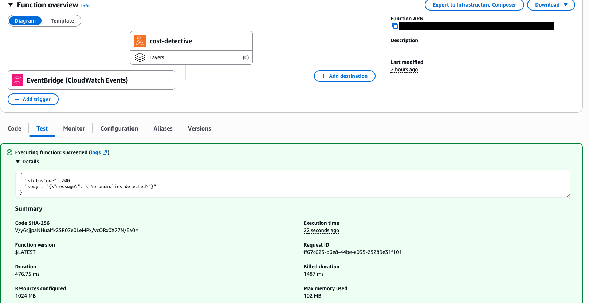
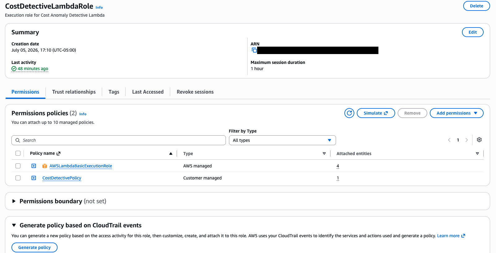
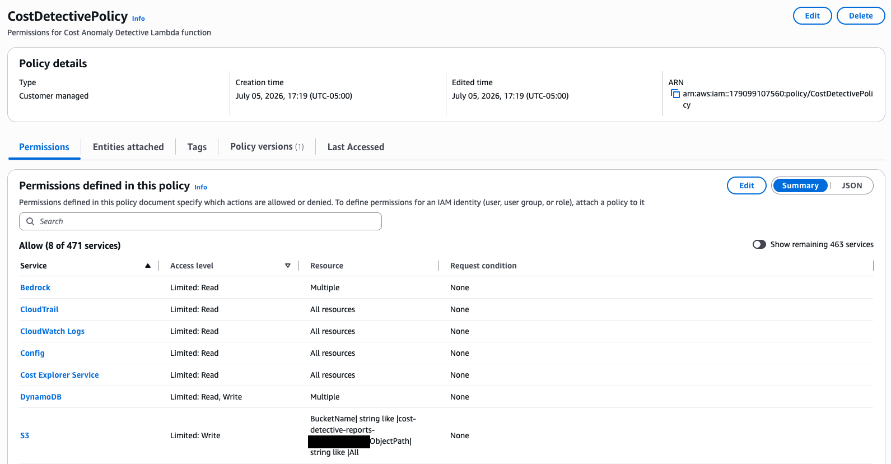
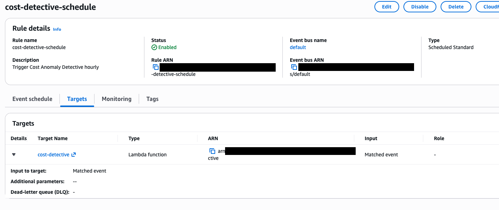
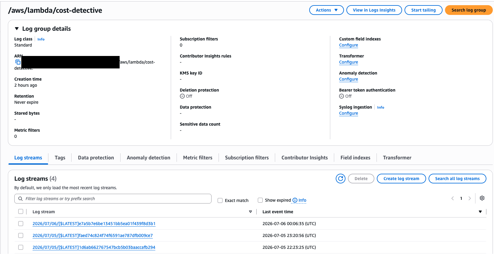

# AWS Cost Anomaly Detective 🔍💰

**Open-Source AI-Powered Cost Anomaly Detection with Amazon Bedrock**

Automatically detect, analyze, and remediate AWS cost spikes using Claude Sonnet 4.6. Goes beyond simple thresholds to provide intelligent root cause analysis, contextual explanations, and actionable remediation code.

[](LICENSE)
[](https://www.python.org/downloads/)
[](https://aws.amazon.com/)

> **Note**: This is a reference architecture and sample project for demonstration purposes. Review and test thoroughly before using in production.

---

## 🤝 Relationship to AWS Cost Anomaly Detection

**AWS announced [AI-powered Cost Investigations](https://aws.amazon.com/blogs/aws-cloud-financial-management/introducing-ai-powered-cost-investigations-for-cost-anomalies/) (June 2026).** This sample project demonstrates the architecture patterns for building AI-powered cost intelligence with Amazon Bedrock.

### How This Project Relates to AWS's Native Feature

This is a **reference architecture and educational sample** that shows:

✅ **Integration patterns** for Cost Explorer + CloudTrail + Bedrock  
✅ **Extension points** for custom remediation workflows  
✅ **Architecture best practices** for event-driven FinOps automation  
✅ **How to build** similar AI-powered operational tools

### Key Differences

| Capability | AWS Native Feature | This Sample Project |
|-----------|-------------------|---------------------|
| **Purpose** | Production-ready managed service | Educational reference architecture |
| **Analysis** | AI-powered root cause via Amazon Q | AI-powered root cause via Bedrock API |
| **Remediation** | Analysis + manual remediation | Demonstrates auto-generated IaC code |
| **Integration** | AWS Console + FinOps Agent | Shows Slack, email, ticketing patterns |
| **Customization** | Managed service | Open source - learn & adapt |

### When to Use This Sample

**Use this project to:**
- 📚 **Learn** how to integrate Bedrock with Cost Explorer APIs
- 🏗️ **Build** custom FinOps automation tools
- 🔧 **Extend** AWS Cost Anomaly Detection with custom workflows
- 🎓 **Understand** AI-powered operational tool architecture
- 🔌 **Prototype** integrations with Slack/Jira/ServiceNow
- 🛠️ **Customize** for specific organizational requirements

**Use AWS's native feature for:**
- Production cost anomaly investigations
- Managed service with AWS support
- Teams already using Amazon Q Developer

---

## 🌟 What This Project Provides

**Educational Sample: Learn How to Build AI-Powered Operational Tools**

This reference architecture demonstrates patterns for extending AWS cost management with custom automation:

| Capability | What You'll Learn | What You Can Build |
|-----------|-------------------|---------------------|
| **Bedrock Integration** | How to use Claude API for operational analysis | AI-powered root cause detection with rich context |
| **Event-Driven Automation** | EventBridge + Lambda + AI workflow patterns | Automated investigation and response systems |
| **Custom Workflows** | Integration with ITSM tools (Slack, Jira, etc.) | Organization-specific alerting and approval flows |
| **IaC Generation** | AI-generated CloudFormation for remediation | Auto-generated code to revert configuration changes |
| **Data Ownership** | Store analysis in your DynamoDB for custom queries | Build custom dashboards and trend analysis |
| **Extensibility** | Open source patterns you can adapt | Apply same patterns to security, compliance, performance |

**Use Case**: Start with [AWS Cost Anomaly Detection](https://aws.amazon.com/aws-cost-management/aws-cost-anomaly-detection/) (recommended), then use this sample to learn how to build custom extensions.

**Example Alert:**
```
🚨 Lambda Cost Spike Detected

Service: AWS Lambda (us-east-1)
Spike: +200% ($150 → $450, $3,600/month projected)

Root Cause:
Function "data-processor" memory increased from 128MB to 3GB
Changed by: john.doe@company.com at 2:15 PM UTC
Change reason: "Quick fix for performance issue" (commit abc123)

AI Analysis:
P95 memory usage is only 850MB. The 3GB allocation is over-provisioned
by 3.5x, causing unnecessary GB-second charges.

Remediation:
Apply this CloudFormation change to reduce memory to 1024MB:
[CloudFormation snippet attached]

Estimated savings: $280/month ($3,360/year)

[Revert Change] [Snooze] [View Full Report]
```

---

## 🏗️ Architecture


**Deployed Infrastructure (Screenshots):**

<details>
<summary>View Deployed AWS Resources</summary>

### DynamoDB Table


### S3 Bucket


### SNS Topic


### Lambda Function Overview


### Lambda Configuration


### Lambda Test Execution


### IAM Role


### IAM Policy


### EventBridge Rule


### CloudWatch Logs


</details>

**High-level flow:**
```
EventBridge (hourly) → Lambda → AI Analysis → Alerts
                         ↓
              ┌──────────┴──────────┐
              │                     │
         Cost Explorer        Context Enrichment
         • Cost data         • CloudTrail (who/when)
         • Service breakdown • Config (what changed)
         • Baselines         • CloudWatch (metrics)
                                    │
                              ┌─────┴─────┐
                              │  Bedrock  │
                              │  Claude   │
                              │ Sonnet 4.6│
                              └─────┬─────┘
                                    │
                    ┌───────────────┼───────────────┐
                    │               │               │
                 DynamoDB        S3 Reports      SNS/Slack
                (history)      (detailed JSON)   (alerts)
```

---

## 🚀 Quick Start

> **Using AWS Organizations?** See our [Multi-Account Deployment Guide](docs/MULTI_ACCOUNT_DEPLOYMENT.md) for deploying across multiple accounts.

### Prerequisites

- AWS Account with Bedrock enabled
- AWS CLI configured
- Python 3.12+
- Permissions: Cost Explorer, CloudTrail, Config, Lambda, Bedrock

### 1-Click Deploy (CloudFormation)

```bash
# Clone repository
git clone https://github.com/aws-samples/sample-aws-cost-anomaly-detective.git
cd aws-cost-anomaly-detective

# Deploy stack
aws cloudformation deploy \
  --template-file cloudformation/deployment-template.yaml \
  --stack-name cost-detective \
  --capabilities CAPABILITY_IAM \
  --parameter-overrides \
    AlertEmail=your-email@example.com \
    SlackWebhookUrl=https://hooks.slack.com/services/YOUR/WEBHOOK/URL
```

### Manual Deploy

```bash
# Install dependencies
cd src
pip install -r requirements.txt -t .

# Create deployment package
zip -r function.zip .

# Create Lambda function
aws lambda create-function \
  --function-name cost-detective \
  --runtime python3.12 \
  --role arn:aws:iam::YOUR_ACCOUNT:role/CostDetectiveRole \
  --handler lambda_function.lambda_handler \
  --zip-file fileb://function.zip \
  --timeout 300 \
  --memory-size 1024
```

---

## ⚙️ Configuration

Edit `config.yaml` or set environment variables:

```yaml
# Analysis settings
lookback_hours: 1                  # How far back to check
threshold_percentage: 50           # Minimum spike % to alert
min_cost_threshold: 1.0            # Ignore services under $1

# Bedrock settings
bedrock_region: us-east-1
bedrock_model_id: anthropic.claude-sonnet-4-6

# Storage
dynamodb_table_name: cost-anomalies
s3_bucket_name: cost-detective-reports

# Alerting
sns_topic_arn: arn:aws:sns:us-east-1:123456789012:cost-alerts
slack_webhook_url: https://hooks.slack.com/services/...
```

---

## 📊 Example Output

### Slack Alert

```
🚨 Cost Anomaly Detected: AWS Lambda

💰 Current Cost: $1,245 (↑ 340% from $290 baseline)
🕐 Detected: 2026-07-02 14:23 UTC
🎯 Severity: High

🔍 Root Cause:
Function "data-processor" memory increased from 128MB to 3GB 
by john.doe@company.com at 02:15 UTC. Memory utilization 
analysis shows only 5% usage.

💡 Recommendation:
Reduce memory to 1024MB for optimal performance.

💵 Estimated Savings: $850/month

[View Full Report] [Apply Fix] [Ignore]
```

### AI Analysis (JSON)

```json
{
  "root_cause": "Lambda function memory over-provisioned",
  "severity": "High",
  "confidence": "High",
  "contributing_factors": [
    "Memory increased 128MB → 3GB (23x increase)",
    "Invocation count unchanged (~1000/hour)",
    "Memory utilization remained at 5%"
  ],
  "remediation_steps": [
    {
      "step": 1,
      "action": "Test with 1024MB memory allocation",
      "expected_savings": "$850/month",
      "risk": "Low",
      "urgency": "This week"
    }
  ],
  "estimated_savings": "$850/month",
  "executive_summary": "Lambda costs spiked due to accidental over-provisioning...",
  "cloudformation_template": "..."
}
```

---

## 💡 Use Cases

### 1. Catch Configuration Errors
- Lambda memory accidentally increased
- RDS instance type upgraded unnecessarily
- S3 replication enabled to wrong region

### 2. Detect Resource Sprawl
- Forgotten EC2 instances left running
- Unused EBS volumes accumulating
- Development resources in production

### 3. Identify Application Issues
- Retry storms increasing API costs
- Memory leaks causing Lambda timeouts
- Database query inefficiencies

### 4. Track Team Accountability
- See WHO made cost-impacting changes
- Correlate deployments with cost spikes
- Enable chargeback with tagging

---

## 📈 Cost Breakdown

**Monthly Operating Cost**: ~$30-50

| Service | Usage | Cost |
|---------|-------|------|
| Lambda | 1,000 invokes/month @ 1GB, 5min | ~$5 |
| Cost Explorer API | ~700 requests/month | ~$7 |
| Amazon Bedrock | ~500K tokens/month (Claude 3.5) | ~$10 |
| DynamoDB | On-demand, low traffic | ~$1 |
| S3 | Report storage | ~$0.50 |
| CloudWatch Logs | 1GB/month | ~$0.50 |
| SNS/EventBridge | Notifications | ~$1 |

**ROI**: Catching ONE misconfigured $500/month resource = **10-15x return**

---

## 🛠️ Advanced Features

### Multi-Account Support

Enable cross-account monitoring with AWS Organizations:

```python
# Set ENABLE_MULTI_ACCOUNT=true
# Lambda assumes OrganizationAccountAccessRole in each account
```

### Auto-Remediation

Apply AI-generated fixes automatically (with approval workflow):

```yaml
auto_remediation:
  enabled: true
  approval_required: true
  slack_approval_channel: "#cost-approvals"
```

### Custom Alerting Rules

```yaml
alert_rules:
  - service: Lambda
    threshold: 30%
    severity_override: Critical
  
  - service: RDS
    threshold: 100%
    cooldown_hours: 6
```

---

## 🧪 Testing Locally

```bash
# Run with test data
python src/lambda_function.py

# Or use SAM Local
sam local invoke CostDetectiveFunction --event examples/test-event.json
```

---

## 📚 Workshop & Blog

- **Workshop**: [Deploy Your Cost Detective in 60 Minutes](docs/WORKSHOP.md)
- **Blog Post**: [Building AI-Powered Cost Intelligence](docs/BLOG.md)

---

## 🤝 Contributing

Contributions welcome! See [CONTRIBUTING.md](CONTRIBUTING.md)

Ideas for enhancements:
- [ ] GCP/Azure cost monitoring
- [ ] Forecasting with time-series models
- [ ] Integration with Jira/ServiceNow for tickets
- [ ] Cost optimization recommendations engine
- [ ] Anomaly detection ML model training

---

## 📄 License

This library is licensed under the MIT-0 License. See the [LICENSE](LICENSE) file.

## 🔒 Security

See [CONTRIBUTING](CONTRIBUTING.md#security-issues) for more information on reporting security issues.

---

## 🙏 Acknowledgments

Built by AWS Solutions Architects to showcase:
- Amazon Bedrock (AI/ML)
- AWS Lambda (Serverless)
- Cost Explorer API (FinOps)
- Event-driven architecture best practices

---

## 📞 Support

- **Issues & Questions**: [GitHub Issues](https://github.com/aws-samples/sample-aws-cost-anomaly-detective/issues)
- **AWS Support**: For production issues, contact AWS Support
- **Author**: [Chezsal Kamaray on LinkedIn](https://www.linkedin.com/in/chezsal-kamaray-beng-hons-msc-pmp-666bb715/)

---

**⭐ If this project helps you save costs, give it a star!**
