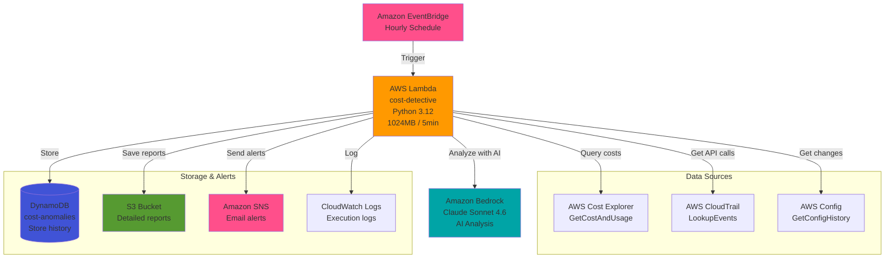
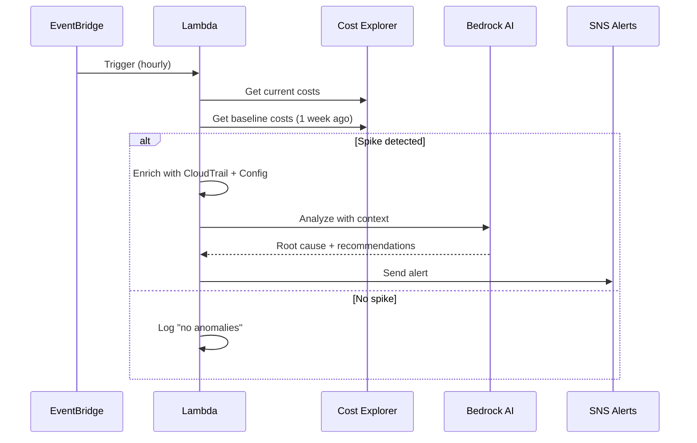
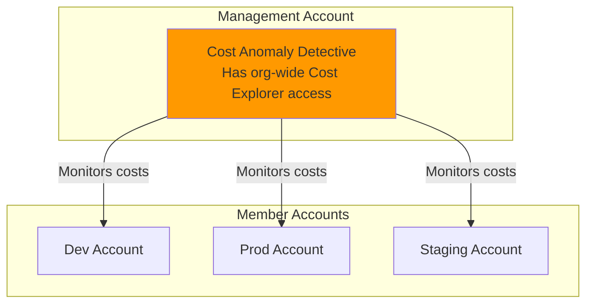

# Architecture Diagram (Mermaid)

## Component Description

| Component | Purpose | Key Details |
|-----------|---------|-------------|
| **EventBridge** | Scheduled trigger | Hourly (configurable) |
| **Lambda** | Orchestrator | Python 3.12, 1024MB, 5min timeout |
| **Cost Explorer** | Fetch costs | Current vs baseline (1 week ago) |
| **CloudTrail** | API activity | Who made what changes |
| **Config** | Resource changes | Instance types, sizes, configs |
| **Bedrock** | AI analysis | Root cause + recommendations |
| **DynamoDB** | Anomaly history | Store for trending |
| **S3** | Detailed reports | JSON format, 90-day retention |
| **SNS** | Email alerts | Real-time notifications |
| **CloudWatch** | Logs | Execution tracking |

## Data Flow

1. **EventBridge** triggers Lambda every hour
2. **Lambda** queries Cost Explorer for current & baseline costs
3. If spike detected (>50%):
   - Query **CloudTrail** for recent API calls
   - Query **Config** for resource changes
   - Query **CloudWatch** for metrics
4. Send context to **Bedrock** for AI analysis
5. Store anomaly in **DynamoDB**
6. Save detailed report to **S3**
7. Send alert via **SNS**
8. Log execution to **CloudWatch**

**Execution time:** ~30-60 seconds  
**Cost per run:** ~$0.01  
**Monthly cost:** ~$30

---

## Simplified Flow Diagram

---

## Multi-Account Deployment

**Key:** Deploy in **management account** for org-wide visibility.

---

For the interactive Draw.io diagram, open: [`architecture-diagram.drawio`](architecture-diagram.drawio)
